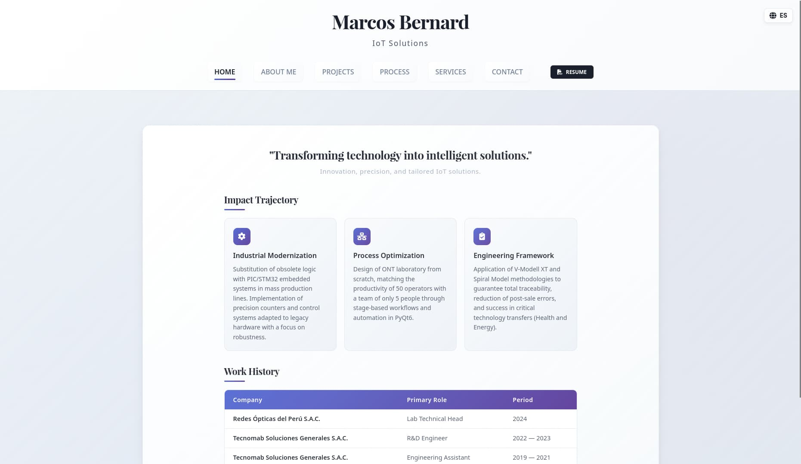
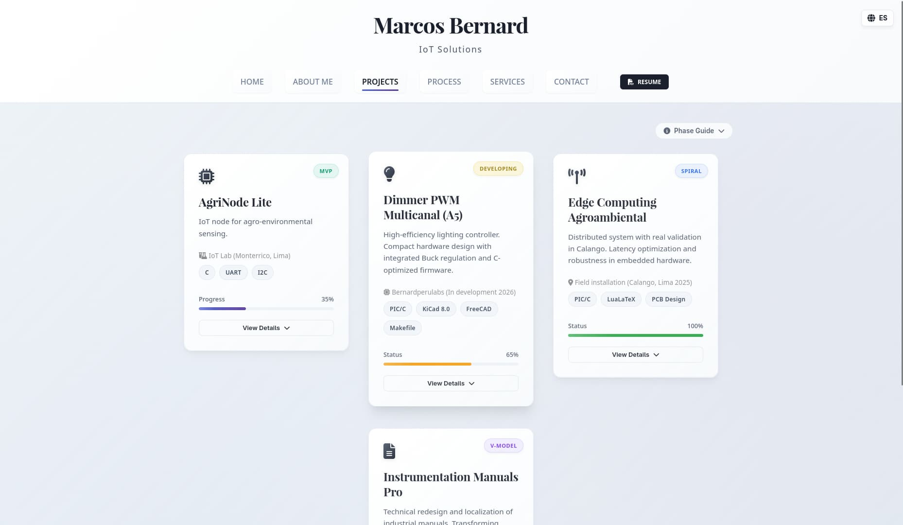
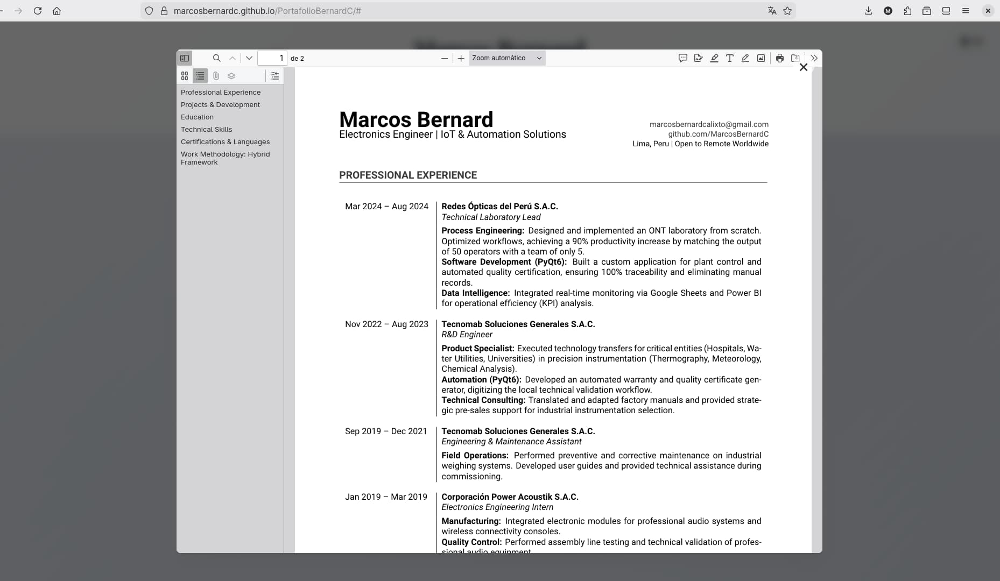

# ⚡ Portafolio Profesional - Marcos Bernard

> **Ingeniería en IoT y Sistemas Embebidos.** Portafolio de alto rendimiento diseñado bajo estándares industriales y optimizado para la exposición de soluciones técnicas complejas.

---

## 📸 Vista Previa del Sistema

  
  
<em>Interfaz Principal: Diseño DIN-Style con jerarquía visual optimizada.</em>

  
  

---

## 🛠️ Stack Tecnológico

- **Frontend Core**: HTML5 Semántico y Arquitectura Modular CSS3.
- **Interactividad**: Vanilla JavaScript para gestión de estados y navegación.
- **Gestión de Datos**: Integración con **Formspree** para endpoints de contacto seguros (Anti-spam).
- **Flujo de Trabajo**: Git con estándar de **Conventional Commits** y despliegue automatizado.

## 🚀 Características de Ingeniería

- **Layout DIN-Style**: Estructura inspirada en "Data Sheets" técnicos, priorizando la lectura eficiente de KPIs y especificaciones.
- **Privacy-First Design**: Protección contra web scrapers mediante formularios desacoplados de la dirección de correo real.
- **Optimización V&V**: Verificación y validación de diseño responsivo (Mobile-First) con targets de 16px para accesibilidad táctil.
- **Trazabilidad**: Alineación total con las competencias definidas en el CV v1.1 y tesis profesional.

## 📋 Metodología de Desarrollo

El proyecto se ejecutó siguiendo un ciclo de vida de desarrollo de software (SDLC) riguroso:

1.  **Análisis de Requisitos**: Definición de perfiles de reclutadores técnicos y stakeholders.
2.  **Diseño de Sistema**: Creación de componentes CSS atómicos y reutilizables.
3.  **Implementación**: Código limpio, libre de frameworks pesados para maximizar la velocidad de carga.
4.  **CI/CD**: Pipeline de publicación automática mediante **GitHub Pages**.

## 📄 Documentación Técnica

Para detalles específicos sobre módulos individuales, consulta la carpeta `docs/`:

- [Análisis de Progreso](docs/analisis-progreso-Portafolio-2025.md)
- [Notas de Diseño](docs/DESIGN_NOTES.md)

---

  <b>Desarrollado con rigor técnico por Marcos Bernard - 2026</b> 
  Lima, Perú | Ingeniería de Sistemas

